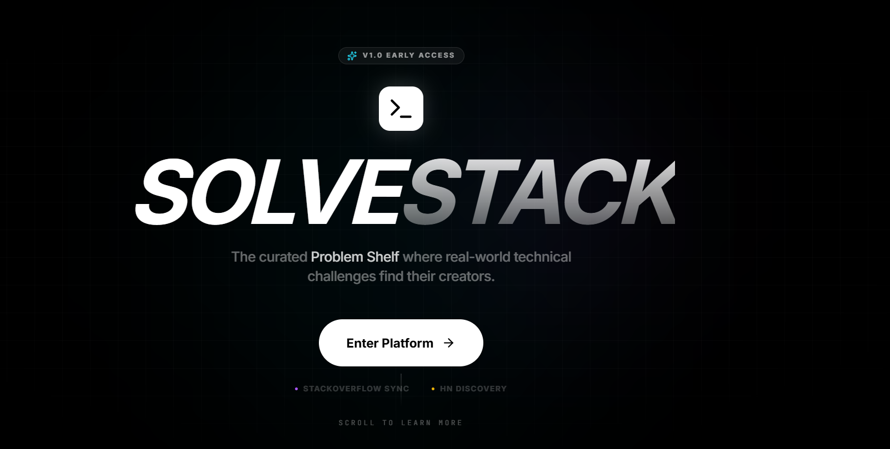
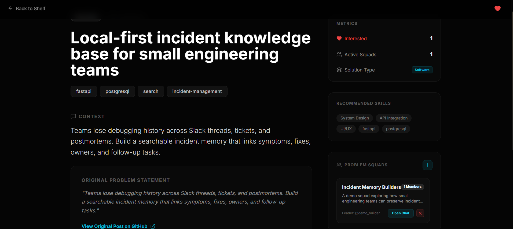
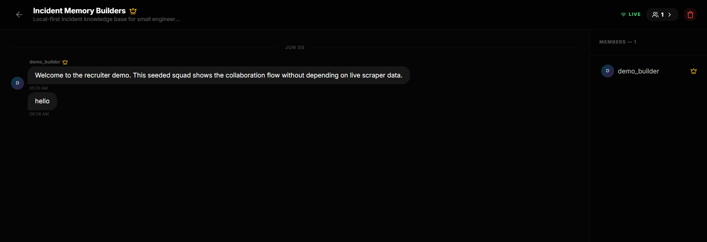
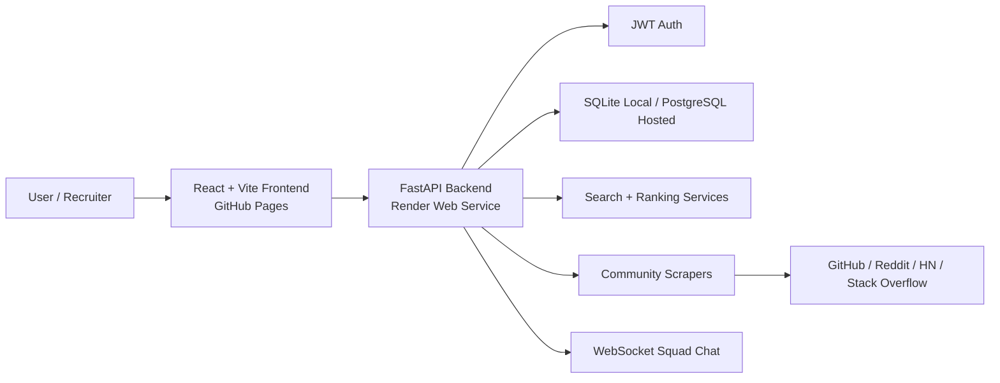

# SolveStack

Full-stack problem discovery and collaboration platform that turns real developer pain points into portfolio-worthy project ideas.

[Live Demo](https://varsha620.github.io/SolveStack-final/) - use the demo credentials below for a guided walkthrough.  
[Backend API](https://solvestack-final.onrender.com/)  
[FastAPI Docs](https://solvestack-final.onrender.com/docs)  
[Deployment Guide](DEPLOYMENT.md)  
[Backend README](SolveStack-main/README.md)  
[Frontend README](solvestack-frontend/README.md)

## Overview

Junior developers often build generic clone projects because it is hard to find real, scoped, technically meaningful problems. SolveStack addresses that by collecting problem signals from developer communities, cleaning and normalizing them, ranking them by engineering value, and helping users form squads around ideas worth building.

The project combines backend API design, data ingestion, search, ranking, authentication, frontend integration, and real-time collaboration into one portfolio-ready product.

## Demo Account

Use this account for a recruiter-friendly walkthrough when the backend is seeded with demo data:

```text
Email: demo@solvestack.dev
Password: Demo@12345
```

The demo seed creates 30+ curated problems, selected interests, active squads, and starter squad chat messages so the product feels alive during review.

The frontend also includes fallback demo data so the UI remains reviewable if the free backend instance is cold, empty, or temporarily unavailable.

## Try These Workflows

1. Discover project ideas  
   Open the dashboard, browse the problem shelf, compare impact scores, and inspect a problem detail page.

2. Search by intent  
   Try searches such as `FastAPI observability`, `resume projects`, or `offline sync` to see the intent-aware search and ranking flow.

3. Join the collaboration loop  
   Sign in with the demo account, open Squads, inspect an active squad, and view the squad chat flow.

## Features

- JWT authentication with protected user flows.
- Problem shelf with filters, search, impact scoring, and problem details.
- Intent-aware search with hybrid, semantic-style, and keyword fallback behavior.
- Engineering Impact Scoring engine that separates portfolio value from implementation difficulty.
- Multi-source scraper architecture for GitHub, Reddit, Hacker News, and Stack Overflow style sources.
- Data cleaning layer for normalization, tag cleanup, technicality checks, and deduplication support.
- Interest tracking so users can save problems they want to build.
- Squad creation, join requests, membership management, and WebSocket chat.
- React/Vite frontend with TypeScript and Tailwind CSS.
- FastAPI backend with SQLAlchemy models and PostgreSQL-ready deployment.
- Render backend configuration and GitHub Pages frontend deployment.

## Screenshots

### Dashboard / Problem Shelf



### Problem Detail



### Squad Chat



## Architecture



## Tech Stack

| Layer | Tools |
| --- | --- |
| Frontend | React, TypeScript, Vite, Tailwind CSS, lucide-react, Recharts |
| Backend | Python, FastAPI, SQLAlchemy, Pydantic, Uvicorn |
| Auth | JWT, Passlib password hashing |
| Database | SQLite for local development, PostgreSQL for hosted deployment |
| Search / Ranking | Query processing, hybrid search, semantic-style retrieval, keyword fallback, Engineering Impact Scoring |
| Realtime | FastAPI WebSockets for squad chat |
| Deployment | GitHub Pages, Render Web Service, Render Postgres |

## Core Data Flow

```text
External sources
  -> scraper modules
  -> cleaning and normalization layer
  -> difficulty and quality feature extraction
  -> Engineering Impact Scoring
  -> database storage
  -> search / dashboard / squads
```

## Scoring Engine

SolveStack uses an Engineering Impact Scoring engine to rank ideas by portfolio and real-world engineering value, not just popularity.

| Signal | What It Captures |
| --- | --- |
| Technical depth | Architecture, scaling, performance, data modeling, async work, and system-design signals |
| Industry impact | Production relevance, security, cost, compliance, reliability, and customer value |
| Cognitive complexity | Tradeoffs, ambiguity, design decisions, and problem-solving depth |
| Signal quality | Specificity, technical density, and whether the problem has enough detail to build from |

Difficulty is tracked separately as Beginner, Intermediate, or Advanced. That distinction matters because a project can be beginner-friendly but still valuable, or advanced because it requires deeper architecture and operational design.

## API Overview

Core endpoints:

```text
POST   /register
POST   /login
GET    /me
GET    /problems
GET    /problems/{problem_id}
GET    /problems/trending
GET    /search?query=...
GET    /search/hybrid?query=...
GET    /search/semantic?query=...
POST   /interest
DELETE /interest/{problem_id}
GET    /squads
POST   /squads
GET    /squads/{squad_id}
POST   /squads/{squad_id}/join
GET    /squads/{squad_id}/messages
WS     /ws/squad/{squad_id}
```

FastAPI documentation:

```text
https://solvestack-final.onrender.com/docs
```

## Local Development

Backend:

```bash
cd SolveStack-main
python -m venv venv
venv\Scripts\activate
pip install -r requirements.txt
copy .env.example .env
python seed_demo_data.py
uvicorn main:app --reload
```

Frontend:

```bash
cd solvestack-frontend
npm install
copy .env.example .env
npm run dev
```

## Deployment Notes

Frontend:

```text
https://varsha620.github.io/SolveStack-final/
```

Backend:

- Deploy as a Render Web Service.
- Root directory: `SolveStack-main`
- Build command: `pip install -r requirements-deploy.txt`
- Start command: `uvicorn main:app --host 0.0.0.0 --port $PORT`
- Use Render Postgres and set `DATABASE_URL` to the internal database URL.

Required backend environment variables:

```text
ENVIRONMENT=production
PYTHON_VERSION=3.11.9
SECRET_KEY=<generated-secret>
FRONTEND_ORIGINS=https://varsha620.github.io
SEED_DEMO_DATA=true
DATABASE_URL=<render-postgres-internal-url>
```

Frontend deployment variables:

```text
VITE_API_URL=https://solvestack-final.onrender.com
VITE_WS_URL=wss://solvestack-final.onrender.com
VITE_DEMO_MODE=fallback
```

## Tradeoffs

- The hosted backend uses a lightweight dependency set so free-tier deployment avoids heavy ML packages.
- Semantic-style search endpoints remain available, with dependable keyword/hybrid fallback when embedding dependencies are unavailable.
- Frontend fallback mode keeps the demo reviewable if the backend is sleeping or empty.
- Live scraper integrations depend on external APIs, credentials, quotas, and rate limits, so seeded demo data is the reliable review path.
- WebSocket chat is implemented for squads, but a production chat system would need stronger moderation, retention, Redis or broker-backed scaling, and observability.

## Repository Structure

```text
SolveStack-final/
+-- SolveStack-main/        # FastAPI backend, models, scrapers, seeds, backend docs
+-- solvestack-frontend/    # React/Vite frontend, Tailwind UI, demo mode
+-- docs/screenshots/       # Product screenshots
+-- .github/workflows/      # GitHub Pages deployment workflow
+-- DEPLOYMENT.md           # Hosting guide
+-- README.md               # Recruiter-facing overview
```

## Portfolio Positioning

SolveStack is strongest as a full-stack portfolio project showing practical backend design, product thinking, deployment readiness, search/ranking logic, and an honest demo strategy. It is not presented as a mature large-scale SaaS; it is a polished, reviewable project built around a real developer problem.
