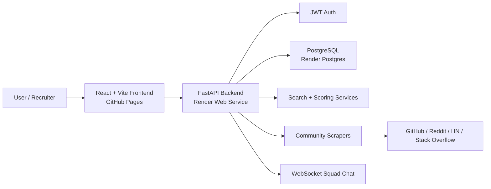

# SolveStack

Full-stack problem discovery and collaboration platform for turning real developer pain points into portfolio-worthy project ideas.

[Live Frontend](https://varsha620.github.io/SolveStack-final/)<br>
Backend API: [https://solvestack-final.onrender.com](https://solvestack-final.onrender.com/)<br>
[Deployment Guide](DEPLOYMENT.md)<br>
[Backend README](SolveStack-main/README.md)  
[Frontend README](solvestack-frontend/README.md)

## Demo Account

Use this account for a recruiter-friendly walkthrough after the backend is deployed with `SEED_DEMO_DATA=true`.

```text
Email: demo@solvestack.dev
Password: Demo@12345
```

The demo seed creates 30+ curated problems, pre-selected interests, active squads, and starter squad chat messages so the product feels alive during review.

## Try These 3 Workflows

1. Discover project ideas
   Open the dashboard, browse seeded problems, compare impact scores, and inspect a problem detail page.

2. Search by intent
   Try searches such as `FastAPI observability`, `resume projects`, or `offline sync` to see the problem retrieval flow.

3. Join the collaboration loop
   Sign in with the demo account, open Squads, inspect the seeded squad, and view the squad chat flow.

## Problem Statement

Junior developers often build generic clone projects because it is hard to find real, scoped, technically meaningful problems. SolveStack collects problem signals from developer communities, normalizes them, ranks them by engineering value, and helps users form squads around ideas worth building.

## Features

- JWT authentication with protected user flows.
- Problem shelf with filtering, search, and engineering impact scoring.
- Multi-source scraper architecture for GitHub, Reddit, Hacker News, and Stack Overflow style sources.
- Demo-safe seeded data for reliable portfolio reviews.
- Interest tracking so users can save problems they want to build.
- Squad creation, join requests, membership management, and WebSocket chat.
- React/Vite frontend with Tailwind/PostCSS styling.
- FastAPI backend with SQLAlchemy models and PostgreSQL-ready deployment.
- Render-ready backend config and GitHub Pages frontend deployment.

## Screenshots

| Area | Placeholder |
| --- | --- |
| Landing / Dashboard | Add `docs/screenshots/dashboard.png` |
| Problem Detail | Add `docs/screenshots/problem-detail.png` |
| Squads / Chat | Add `docs/screenshots/squad-chat.png` |

Suggested screenshot flow: dashboard with seeded cards, one detailed problem page, and the demo squad chat page.

## Architecture



## Tech Stack

| Layer | Tools |
| --- | --- |
| Frontend | React, TypeScript, Vite, Tailwind CSS, lucide-react |
| Backend | FastAPI, SQLAlchemy, Pydantic, Uvicorn |
| Auth | JWT, passlib password hashing |
| Database | SQLite for local dev, PostgreSQL for hosted deployment |
| Search / Ranking | Keyword fallback search, scoring services, optional embedding path |
| Deployment | GitHub Pages, Render Web Service, Render Postgres |

## API Overview

Core endpoints:

```text
POST   /register
POST   /login
GET    /me
GET    /problems
GET    /problems/{problem_id}
GET    /problems/trending
GET    /search?query=...
GET    /search/semantic?query=...
POST   /interest
DELETE /interest/{problem_id}
GET    /squads
POST   /squads
GET    /squads/{squad_id}
POST   /squads/{squad_id}/join
GET    /squads/{squad_id}/messages
WS     /ws/squad/{squad_id}
```

FastAPI docs are available at:

```text
<your-render-backend-url>/docs
```

## Deployment Notes

Frontend:

```text
https://varsha620.github.io/SolveStack-final/
```

Backend:

- Deploy as a Render Web Service.
- Root directory: `SolveStack-main`
- Build command: `pip install -r requirements-deploy.txt`
- Start command: `uvicorn main:app --host 0.0.0.0 --port $PORT`
- Use Render Postgres and set `DATABASE_URL` to the internal database URL.

Required backend environment variables:

```text
ENVIRONMENT=production
PYTHON_VERSION=3.11.9
SECRET_KEY=<generated-secret>
FRONTEND_ORIGINS=https://varsha620.github.io
SEED_DEMO_DATA=true
DATABASE_URL=<render-postgres-internal-url>
```

The frontend deploy workflow is configured with:

```text
VITE_API_URL=https://solvestack-final.onrender.com
VITE_WS_URL=wss://solvestack-final.onrender.com
VITE_DEMO_MODE=fallback
```

## Local Development

Backend:

```bash
cd SolveStack-main
python -m venv venv
venv\Scripts\activate
pip install -r requirements.txt
copy .env.example .env
python seed_demo_data.py
uvicorn main:app --reload
```

Frontend:

```bash
cd solvestack-frontend
npm install
copy .env.example .env
npm run dev
```

## Tradeoffs

- The hosted deployment uses a lightweight backend dependency set so Render deploys faster and avoids heavy ML packages.
- Search falls back to dependable keyword-style retrieval when embedding dependencies are unavailable.
- The frontend keeps demo fallback mode enabled so recruiters can still explore the UI if the free backend instance is sleeping.
- Some scraper integrations depend on external APIs and rate limits, so seeded demo data is the reliable review path.
- WebSocket chat is implemented for squads, but a production chat system would need stronger moderation, retention, and scaling controls.

## Repository Structure

```text
SolveStack-final/
+-- SolveStack-main/        # FastAPI backend, models, scrapers, seeds, backend docs
+-- solvestack-frontend/    # React/Vite frontend, Tailwind UI, demo mode
+-- .github/workflows/      # GitHub Pages deployment workflow
+-- DEPLOYMENT.md           # Hosting guide
+-- README.md               # Recruiter-facing overview
```

## Portfolio Positioning

SolveStack is strongest as a full-stack portfolio project showing practical backend design, product thinking, deployment readiness, and an honest demo strategy. It is not presented as a large-scale production SaaS; it is a polished, reviewable project built around a real developer problem.
